# 🚀 AI Stock Advisor - System Architecture Diagram

## 📊 **High-Level Architecture**

```mermaid
graph TB
    subgraph "🌐 User Interface Layer"
        UI[Streamlit Web App]
        T1[📊 Stock Summary]
        T2[💡 Watchlist Suggestions]
        T3[📋 Compare Stocks]
        T4[💰 Portfolio Allocator]
        T5[🔬 Advanced Analysis]
    end
    
    subgraph "🤖 AI/ML Layer"
        GPT[OpenAI GPT-4 API]
        AI_ANALYSIS[AI Investment Analysis]
        RECOMMENDATIONS[Smart Recommendations]
    end
    
    subgraph "📡 Data Sources"
        YF[Yahoo Finance API]
        NEWS[NewsAPI]
        FH[Finnhub API]
        TRENDING[Trending Stocks API]
    end
    
    subgraph "⚙️ Processing Engine"
        TECH[Technical Analysis]
        FUND[Fundamental Analysis]
        RISK[Risk Management]
        BACKTEST[Backtesting Engine]
    end
    
    subgraph "💾 Data Processing"
        PANDAS[Pandas/NumPy]
        CACHE[Session State Cache]
        VALIDATION[Input Validation]
    end
    
    subgraph "☁️ Deployment"
        CLOUD[Streamlit Cloud]
        GIT[GitHub Repository]
        SECRETS[API Keys Management]
    end
    
    %% User Interface Connections
    UI --> T1
    UI --> T2
    UI --> T3
    UI --> T4
    UI --> T5
    
    %% AI Layer Connections
    T1 --> GPT
    T2 --> GPT
    T3 --> GPT
    T5 --> AI_ANALYSIS
    AI_ANALYSIS --> GPT
    GPT --> RECOMMENDATIONS
    
    %% Data Source Connections
    T1 --> YF
    T1 --> NEWS
    T2 --> TRENDING
    T3 --> YF
    T4 --> YF
    T5 --> YF
    T5 --> FH
    
    %% Processing Engine Connections
    T5 --> TECH
    T5 --> FUND
    T5 --> RISK
    T5 --> BACKTEST
    
    %% Data Processing Connections
    YF --> PANDAS
    NEWS --> PANDAS
    FH --> PANDAS
    TECH --> PANDAS
    FUND --> PANDAS
    RISK --> PANDAS
    BACKTEST --> PANDAS
    
    %% Cache and Validation
    PANDAS --> CACHE
    UI --> VALIDATION
    VALIDATION --> CACHE
    
    %% Deployment Connections
    CLOUD --> GIT
    CLOUD --> SECRETS
    CLOUD --> UI
```

## 🔄 **Data Flow Diagram**

## 🏗️ **Component Architecture**

## 📱 **User Journey Flow**

## 🔧 **Technical Stack Diagram**

## 🎯 **Feature Module Breakdown**

---

## 📝 **How to Use These Diagrams**

1. **Copy the Mermaid code** from any section above
2. **Paste into GitHub** - GitHub natively supports Mermaid diagrams
3. **Use in Markdown viewers** - Most modern Markdown viewers support Mermaid
4. **Online renderers** - Use [Mermaid Live Editor](https://mermaid.live/) to generate images
5. **Documentation** - Include in your project README or technical documentation

These diagrams comprehensively show your AI Stock Advisor's architecture, data flow, user journey, and technical components - perfect for technical presentations, documentation, and showcasing your system design skills!
